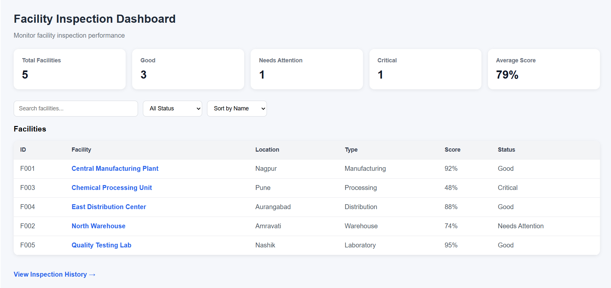
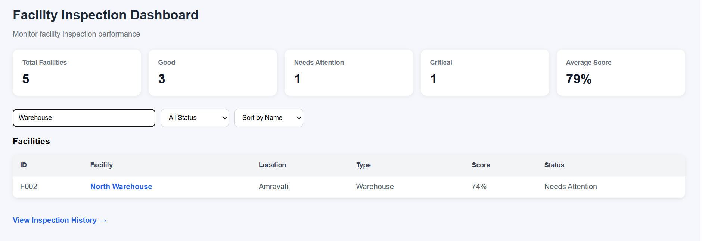
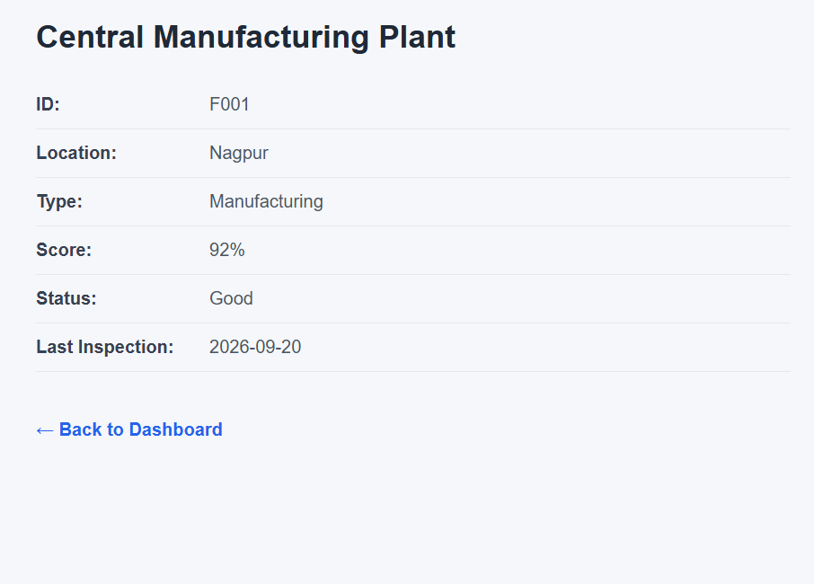
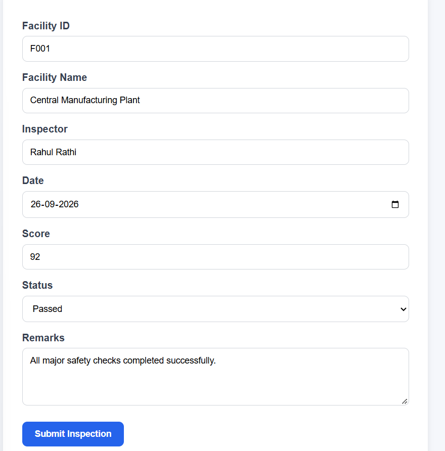
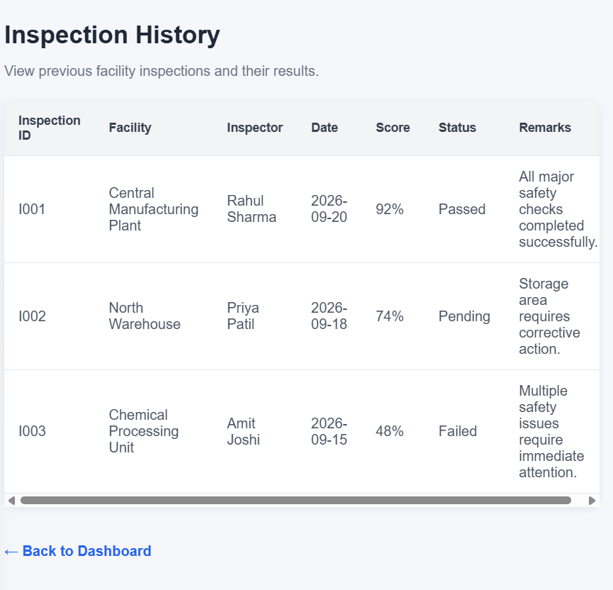

#  Day 9 – Angular + TypeScript + API Integration

## Project Overview

Day 9 focuses on Angular, TypeScript, REST API integration, routing, forms, services, dependency injection, and RxJS basics.

The practical project is a **Facility Inspection Dashboard** that allows users to monitor facility inspection performance, search and filter facilities, view facility details, submit inspections, and view inspection history.

The project contains two parts:

- `angular-app` – Angular frontend application
- `api-integration` – Node.js + Express REST API

---

## Problem Statement

Facility inspection information needs to be monitored in a structured and user-friendly way.

The objective is to develop a web application that can:

- Display facility inspection metrics
- List facility information
- Search and filter facilities
- Sort facility records
- View individual facility details
- Submit new inspection records
- Display inspection history
- Retrieve facility data through a REST API

---

## Features

### Dashboard

- Total facility count
- Good facilities count
- Needs Attention count
- Critical facilities count
- Average inspection score
- Facility search
- Status filtering
- Sorting by name, score, and location

### Facility Details

- Facility ID
- Facility name
- Location
- Facility type
- Inspection score
- Status
- Last inspection date

### Inspection Form

- Facility ID
- Facility name
- Inspector name
- Inspection date
- Inspection score
- Inspection status
- Remarks
- Form validation
- Successful submission message

### Inspection History

- Inspection ID
- Facility
- Inspector
- Date
- Score
- Status
- Remarks

### REST API

- Get all facilities
- Get facility by ID
- API health check
- CORS support
- JSON request/response handling

---

## Technology Stack

### Frontend

- Angular 21
- TypeScript
- HTML
- CSS
- Angular Router
- Angular Forms
- Angular HttpClient
- RxJS

### Backend

- Node.js
- Express.js
- CORS

### Development Tools

- Visual Studio Code
- PowerShell
- Git
- GitHub

---

## Project Structure

```text
day-09/
│
├── angular-app/
│   ├── src/
│   │   └── app/
│   │       ├── models/
│   │       │   └── facility.model.ts
│   │       │
│   │       ├── pages/
│   │       │   ├── dashboard/
│   │       │   ├── facility-details/
│   │       │   ├── facilities/
│   │       │   ├── inspection-form/
│   │       │   └── inspection-history/
│   │       │
│   │       ├── services/
│   │       │   └── facility.service.ts
│   │       │
│   │       ├── app.ts
│   │       ├── app.html
│   │       ├── app.css
│   │       ├── app.config.ts
│   │       └── app.routes.ts
│   │
│   └── package.json
│
├── api-integration/
│   ├── server.js
│   ├── package.json
│   └── package-lock.json
│
└── README.md
Architecture

The application follows a simple client-server architecture.

              Angular Frontend
                    │
                    │ HTTP Requests
                    ▼
          FacilityService
                    │
                    │ REST API
                    ▼
          Express.js Backend
                    │
                    ▼
             Facility Data

The Angular application communicates with the Express REST API using HttpClient.

TypeScript Model

The project uses TypeScript interfaces to define the structure of facility and inspection data.

Facility
export interface Facility {
  id: string;
  name: string;
  location: string;
  type: string;
  status: 'Good' | 'Needs Attention' | 'Critical';
  lastInspection: string;
  score: number;
}
Inspection
export interface Inspection {
  id: string;
  facilityId: string;
  facilityName: string;
  inspector: string;
  date: string;
  score: number;
  status: 'Passed' | 'Failed' | 'Pending';
  remarks: string;
}
Angular Concepts Implemented
Components

Separate components/pages are used for:

Dashboard
Facility Details
Inspection Form
Inspection History
Data Binding

The project uses:

Interpolation
Property binding
Event binding
Two-way binding

Example:

<input [(ngModel)]="searchTerm">
Directives

Angular directives such as:

*ngIf
*ngFor

are used for conditional rendering and displaying lists.

Pipes

Angular template expressions can use pipes for formatting and transforming displayed data.

Services

FacilityService is responsible for communicating with the REST API and managing inspection data.

Dependency Injection

Angular services are injected into components through constructors.

Routing

The application uses Angular Router for navigation.

Routes include:

/dashboard
/facilities/:id
/inspection
/inspection-history
Route Parameters

Facility IDs are passed through the route:

/facilities/F001
Forms

Template-driven forms with ngModel are used for inspection submission and validation.

HTTP Client

Angular HttpClient is used to communicate with the Express API.

Observables

API responses are handled using RxJS Observables and subscribe().

API Documentation

Base URL:

http://localhost:3000/api
Get All Facilities
GET /api/facilities

Returns all facility records.

Get Facility by ID
GET /api/facilities/:id

Example:

GET /api/facilities/F001
Health Check
GET /api/health

Example response:

{
  "status": "API is running",
  "message": "Facility Inspection API"
}
Installation
Frontend

Navigate to the Angular application:

cd angular-app

Install dependencies:

npm install
Backend

Navigate to the API:

cd api-integration

Install dependencies:

npm install
How to Run
Start the REST API

From the api-integration directory:

node server.js

The API runs on:

http://localhost:3000
Start the Angular Application

From the angular-app directory:

npx ng serve

The frontend runs on:

http://localhost:4200

Open the application in a browser.

API Integration

The Angular service uses the REST API:

private apiUrl = 'http://localhost:3000/api';

Facilities are retrieved using:

getFacilities(): Observable<Facility[]> {
  return this.http.get<Facility[]>(`${this.apiUrl}/facilities`);
}

Individual facilities are retrieved using:

getFacilityById(id: string): Observable<Facility | undefined> {
  return this.http.get<Facility>(`${this.apiUrl}/facilities/${id}`);
}
Error Handling

The application includes basic error handling for API requests.

Examples include:

API loading errors
Missing facility IDs
Facility not found messages
Inspection submission errors

Loading states are also displayed while facility information is being retrieved.

## Screenshots

### 1. Facility Inspection Dashboard



### 2. Search and Filter



### 3. Facility Details



### 4. New Inspection Form



### 5. Inspection History




Challenges Faced
1. Angular CLI and Node.js Version Compatibility

The latest Angular CLI version required a newer Node.js version, so Angular CLI 21 was used for compatibility with the available Node.js environment.

2. API Integration

The Angular frontend initially required debugging to correctly display data received from the REST API.

3. Change Detection

The dashboard and facility details pages required explicit change detection after asynchronous API responses.

This was handled using:

ChangeDetectorRef

and:

this.changeDetector.detectChanges();
4. Routing and Route Parameters

Dynamic facility routes were implemented using:

/facilities/:id

The facility ID is retrieved using Angular's ActivatedRoute.

Solutions
Used a compatible Angular CLI version.
Created a separate Express REST API.
Used TypeScript interfaces for structured data.
Used Angular HttpClient for API communication.
Used Angular Router for page navigation.
Used ChangeDetectorRef where required for asynchronous UI updates.
Added form validation using Angular Forms.
Future Improvements
Connect the application to a MySQL database.
Add authentication and authorization.
Add user roles such as Admin and Inspector.
Add pagination for large facility datasets.
Add charts for inspection performance.
Add advanced filtering.
Store inspection records permanently through the backend.
Add automated API and frontend testing.
Deploy the Angular application and REST API.
Conclusion

The Day 9 project demonstrates the use of Angular and TypeScript to build a structured frontend application and integrate it with a REST API.

The Facility Inspection Dashboard combines Angular components, routing, forms, services, dependency injection, HTTP communication, Observables, TypeScript interfaces, and Express.js API integration into a practical application.
